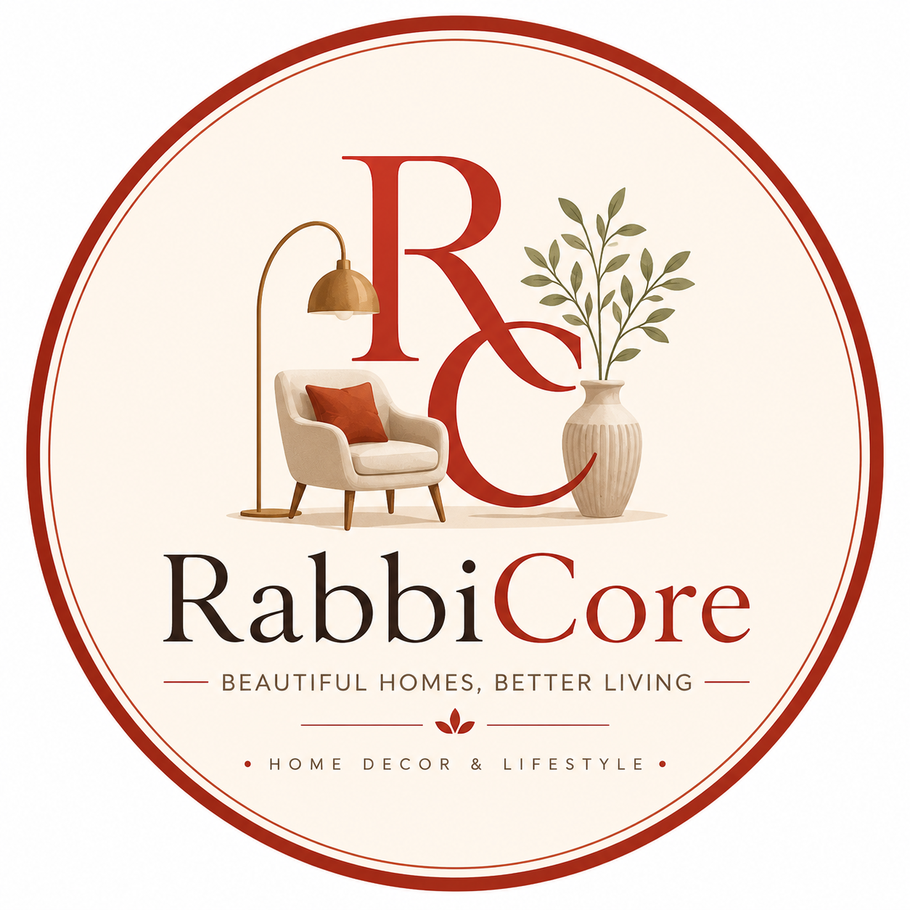

# 🏡 RabbiCore

### *Beautiful Homes, Better Living*

**A modern, editorial-style home decor storefront built with React and Vite.**
Curated products, real decorating guides, and a full self-serve admin dashboard,
wrapped in a warm, terracotta-and-cream design language.

---

## ✨ About the Project

**RabbiCore** is a full featured home decor and lifestyle storefront concept, built to feel
like a real, living e-commerce brand rather than a template demo. It blends two things that
usually live on separate sites: a genuinely shoppable product catalog, and real, useful
decorating editorial content, buying guides, room ideas, and styling tips, all under one roof.

Every corner of the experience was designed around a simple idea: home decor shopping should
feel warm, curated, and a little inspiring, not like scrolling a spreadsheet. From the hero
banner down to the footer, RabbiCore leans into soft cream backgrounds, warm terracotta
accents, and elegant serif typography to create a boutique, editorial feel.

Behind the scenes, RabbiCore also ships with its own private admin dashboard, letting a store
owner manage the entire catalog, content, and homepage layout without ever touching code.

### 🔗 [**Visit the Live Site →**](https://rabbicore.netlify.app/)

---

## 🌟 Features

### 🛍️ Storefront Experience
- Elegant, animated homepage with a rotating hero, curated collections, and trending picks
- Full shop experience with category browsing, live filtering, sorting, and pagination
- Rich product detail pages: image gallery, specs, reviews, ratings, and related products
- Wishlist and cart, persisted right in the browser so nothing is lost on refresh
- Global search with instant results across products and articles
- Curated **Collections** (Best Sellers, On Sale, Scandinavian Edit, Boho Living, and more)

### 📝 Editorial & Content
- A full **Ideas** hub with real, in-depth decorating articles and room-by-room guides
- Dedicated **Buying Guides** section to help shoppers choose with confidence
- Category-based article browsing, related articles, and a shoppable "Shop the Look" section

### 🎨 Design & Experience
- Warm, cohesive design system: custom color palette, serif display type, and soft shadows
- Scroll-triggered reveal animations, hover states, and smooth page transitions throughout
- Fully responsive, from large desktop layouts down to compact mobile screens
- Toast notifications, empty states, and loading skeletons for a polished, native-app feel

### 🔐 Admin Dashboard
- Secure, role-based login with distinct Admin and Super Admin access levels
- Full CRUD control: add, edit, and delete any product or article
- Built-in rich text editor for writing and formatting articles
- Homepage Builder to toggle which sections appear on the homepage, live
- Manage categories, collections, media, and site-wide settings from one place
- Super Admin tools to add or remove other admin accounts

### 📬 Real Integrations
- Newsletter signup, contact form, and product suggestion form, all fully functional
- Affiliate-ready product links for a genuine e-commerce monetization flow

---

## 🛠️ Technology Stack

| Layer | Technology |
|---|---|
| **Framework** | React 18 |
| **Build Tool** | Vite 5 |
| **Routing** | Custom lightweight client-side router |
| **Styling** | Hand-crafted CSS design system (custom properties, no framework overhead) |
| **Icons** | React Icons |
| **State Management** | React Context API |
| **Persistence** | Browser Local Storage |
| **Forms** | Formspree |
| **Deployment** | Netlify |

---

## 🌐 Live Demo

### **[https://rabbicore.netlify.app/](https://rabbicore.netlify.app/)**

Explore the storefront, browse the shop, read a few decorating guides,
and see the whole experience in action.

---

*RabbiCore, curated home decor pieces and inspiring ideas for every space.*

